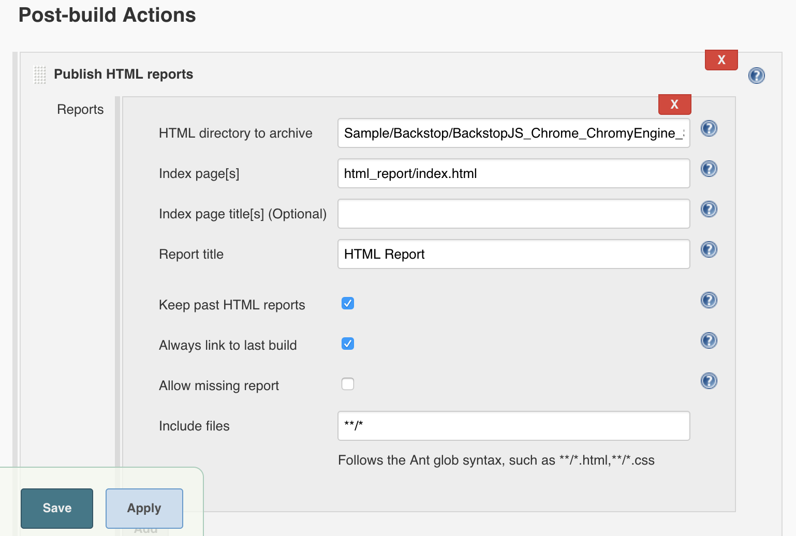
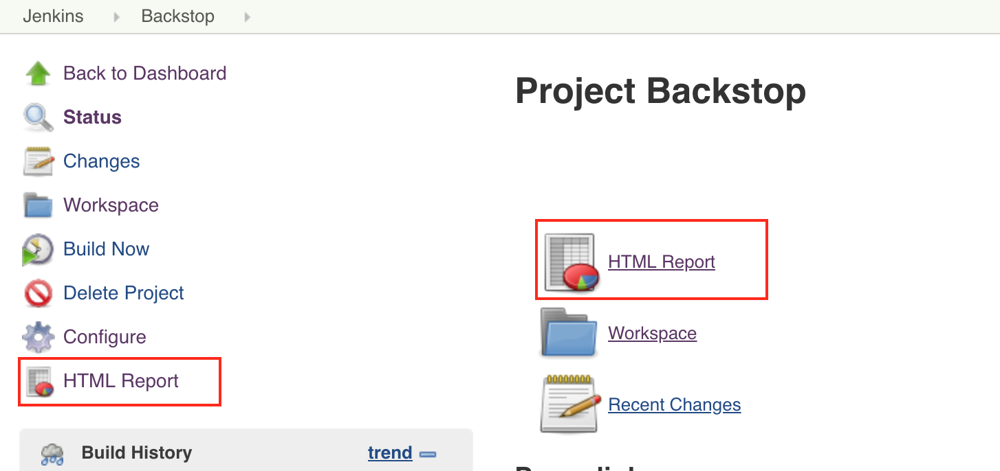

# Jenkins Integration

Here, we use the DooD (Docker-outside-of-Docker) to run the jenkins.

For more info about DooD, we **HIGHLY** suggest to read [the blog](https://container-solutions.com/running-docker-in-jenkins-in-docker/) first.

## Content
- [Pre Conditions](#pre-conditions)
- [Jenkins Master](#jenkins-master)
- [Jenkins Slave](#jenkins-slave)
- [Run BackstopJS](#run-backstopjs)

## Pre Conditions
1. Download docker bin file to the **HOST Machine**, from here: [Linux](https://download.docker.com/linux/static/stable/x86_64/), [Mac](https://download.docker.com/mac/static/stable/x86_64/)
2. Download & Install docker to the **HOST Machine**: [Linux](https://docs.docker.com/install/linux/docker-ce/centos/), [Mac](https://download.docker.com/mac/stable/Docker.dmg)

## Jenkins Master
1. Pull the latest Jenkins LTS: 
   ```
   docker pull jenkins/jenkins:lts
   ```
2. Use RebuildJenkins/Dockerfile to rebuild image as "jenkins/jenkins2:lts": 
   ```
   docker build -t jenkins/jenkins2:lts .
   ```
3. Run Jenkins - Master
   
   For more info about how to use the jenkins/jenkins:lts, please refer to: [https://github.com/jenkinsci/docker/blob/master/README.md](https://github.com/jenkinsci/docker/blob/master/README.md)

   Here, create a '~/jenkins_home' docker volume on the HOST machine, that will survive the container stop/restart/deletion.
   
   ``` 
   docker run \
       -p 8080:8080 \
       -p 50000:50000 \
       -v ~/jenkins_home:/var/jenkins_home \
       -v /var/run/docker.sock:/var/run/docker.sock \
       -v ~/Downloads/docker/docker:/usr/bin/docker \
       --name jenkins2 \
       -d \
       --rm \
       jenkins/jenkins2:lts
   ```
4. Open [http://127.0.0.1:8080/](http://127.0.0.1:8080/), and follow the jenkins guid to finish the installation.
5. Install Additional Plugins in [http://127.0.0.1:8080/pluginManager/available](http://127.0.0.1:8080/pluginManager/available) with "Install without restart":
   - HTML Publisher
   - Post build task
6. Go to [http://127.0.0.1:8080/script](http://127.0.0.1:8080/script), and execute the command to avoid blank html report issue.
    ```
    System.setProperty("hudson.model.DirectoryBrowserSupport.CSP"," ")
    ```
7. Create a Slave node
   - Go to [http://127.0.0.1:8080/computer/](http://127.0.0.1:8080/computer/)
   - Click "New Node", enter "Slave 1" to set as following: 
     
   - Set "Remote root directory" to "/home/jenkins", and set "Launch agent via Java Web Start" as following:
     
   - Click Save, and mark the secret for later use as following:
     
    
## Jenkins Slave
1. Pull the latest Jenkins jnlp-slave: 
   ```
   docker pull jenkins/jnlp-slave
   ```
2. Use RebuildJenkinsJnlpSlave/Dockerfile to rebuild image as "jenkins/jnlp-slave2:latest": 
   ```
   docker build -t jenkins/jnlp-slave2 .
   ```
3. Start container for agent:
   For more info about how to use jenkins/jnlp-slave2, please refer to: [https://github.com/jenkinsci/docker-jnlp-slave](https://github.com/jenkinsci/docker-jnlp-slave)
   > Note: The master url should be **172.17.0.1:8080** between the docker containers
   ```
   docker run \
        -v ~/jenkins_home:/home/jenkins \
        -v /var/run/docker.sock:/var/run/docker.sock \
        -v YOUR_DOCKER_BIN_FILE:/usr/bin/docker \
        --name jenkins_agent_1 \
        -d \
        --rm \
        jenkins/jnlp-slave2 -url http://172.17.0.1:8080 YOUR_SECRET Slave1
   ```
   For example:
   ```
   docker run \
        -v ~/jenkins_home:/home/jenkins \
        -v /var/run/docker.sock:/var/run/docker.sock \
        -v ~/Downloads/docker/docker:/usr/bin/docker \
        --name jenkins_agent_1 \
        -d \
        --rm \
        jenkins/jnlp-slave2 -url http://172.17.0.1:8080 127b664578e071d8c5f78bc1f7c43500d1acefc043bff3572f880919a4595010 Slave1
   ```
4. You could see your agent working as below.
   

## Run BackstopJS
1. Go to [http://127.0.0.1:8080/newJob](http://127.0.0.1:8080/newJob), and select a "Freestyle project" to create a job
   
2. Configure
   - General: Set a project name **Backstop**, and set "Restrict where this project can be run" to "visual-regression-testing"
     
   - Source Code Management: For a instance, you could clone or folk [https://github.com/garris/BackstopJS](https://github.com/garris/BackstopJS), and then set as following with your own git credential
     
   - Build Triggers: For examples, 
     1) You could run daily test by setting: **Build periodically** to **H 08 * * 1-5**
     2) You could Select **Poll SCM** and write "H/5 * * * *". This tells Jenkins to “ask” your repository every 5 minutes if there are changes. If there are any, trigger the job.
   - Build: Add **Execute Shell**, and add following for a sample.
     > Note: 
     > 1) Please use sudo docker to run test. This is a security risk for DooD.
     > 2) You mount any volumes to the container by using --volumes-from \<container name\>
       
     ```
     set +x
     sudo docker pull backstopjs/backstopjs:latest
     sudo docker run \
         --workdir /src \
         --volumes-from jenkins_agent_1 \
         --rm \
         --shm-size 2048m \
         --name backstopjs \
         backstopjs/backstopjs:latest \
         /bin/bash -c "cd Sample/Backstop/BackstopJS_Chrome_ChromyEngine_SimulatePC_iPhone; backstop test"
         
     # Debug Purpose: It will keep container there until job aborted
     # sudo docker run \
     #    --workdir /src \
     #    --volumes-from jenkins_agent_1 \
     #    --rm \
     #    --shm-size 2048m \
     #    --name backstopjs \
     #    --entrypoint=sh \
     #    backstopjs/backstopjs:latest \
     #    -c "cp -R ${WORKSPACE} /src; while true; do sleep 1; done"
     ```
   - Post-build Actions: 
     1) Add **Post build task** to delete the not exiting container
        ```
        if [ "$(sudo docker ps -q -f name=backstopjs)" ]; then
            sudo docker rm -f backstopjs
        fi
        ```
        
        
     2) Add **Publish HTML reports**, and set as following.
        Note: The **HTML directory to archive** is: Sample/Backstop/BackstopJS_Chrome_ChromyEngine_SimulatePC_iPhone/backstop_data/ 
        
     
3. Run build & Get the report
    
